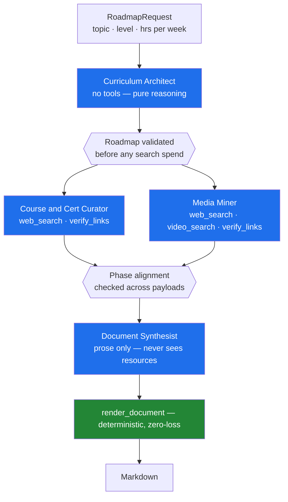

# Skill Forge

A multi-agent system that turns any skill into a Zero-to-Hero learning roadmap —
four pedagogical phases, vetted free and paid courses, real industry
certifications, and curated documentation and video, assembled into a single
Markdown document with every link verified.

```bash
uv run skill-forge "Kubernetes" --hours 10
```

```
Skill Forge — Kubernetes
  model  : openai:gpt-4.1-mini
  learner: Beginner, 10 hrs/week

Kubernetes Zero-to-Hero: From Fundamentals to Mastery
  130 hours over 14 weeks · 4 phases
  14 courses · 42 supplementary resources
  architect: 25.6s | curate+mine: 160.3s | synthesis: 5.6s | total: 191.6s

Written to output/kubernetes.md
```

**Example output:** [Kubernetes](docs/example-kubernetes-roadmap.md) ·
[Git](docs/example-git-roadmap.md) ·
[Gen AI for Product Managers](docs/example-genai-pm-roadmap.md) — a non-technical
topic, included because it exercised different sources and different failure modes

**Design spec:** [the original architecture document](docs/design-spec.md), and
a record of where the implementation deliberately departed from it.

---

## Architecture

Four specialised agents in a plan-and-execute DAG, with a concurrent middle
stage and a deterministic assembly step.



The Curator and Miner run concurrently in a thread pool — neither depends on the
other, and both are dominated by network wait.

---

## The four decisions that matter

Most of this project is ordinary CrewAI wiring. Four choices are not, and they
are the reason the output is trustworthy.

### 1. Validation is a retry signal, not a crash

Every rule from the design spec is a Pydantic constraint: every phase must offer
a free option, certifications must be real or explicitly `N/A`, week counts must
match phase hours, topic titles may not be placeholders like "Advanced Topics".

The obvious way to enforce that is CrewAI's `output_pydantic`. It does not work.
A `ValidationError` there is **fatal** — `handle_partial_json` re-raises it, and
only malformed *JSON* gets a repair attempt. A well-formed payload that violates
the schema kills the run outright.

`Task.guardrail` behaves differently: on failure it feeds the error back to the
agent as context and re-runs it. So the strict models stay, and
[`guardrails.py`](src/skill_forge/guardrails.py) adapts them into guardrails that
return actionable messages.

This is not theoretical. From a real run:

```
Guardrail blocked (attempt 1/4), retrying due to:
  phase_4 recommends exactly the same courses as phase_3
→ agent re-searched: "freeCodeCamp Git internals", "Pluralsight Git internals"
→ passed
```

The agent detected its own lazy curation and fixed it, unattended.

### 2. Link verification is enforced, not requested

The agents have a `verify_links` tool and their briefs tell them to use it
before finishing. That is not a guarantee, and the gap is not theoretical.

On a real run, the Media Miner hit CrewAI's `max_iter` ceiling. Told
"Maximum iterations reached. Requesting final answer.", it did not return fewer
resources — it **invented** them. Nine dead links across phases 3 and 4,
including `martinfowler.com/articles/scalable-ai.html` and
`hbr.org/2024/01/leading-ai-strategy`, neither of which has ever existed. It
never called `verify_links`, and nothing required it to.

So [`verify.py`](src/skill_forge/verify.py) checks every URL after the agents
finish, regardless of what they claim to have done, and removes what is dead.
Where removal would violate a schema guarantee — a phase's only free course —
the link stays and is marked ⚠️ in the document, because silently shipping a
known-broken link falsifies the document's own claim.

One further wrinkle: **YouTube answers an invalid video ID with HTTP 200**, so
HTTP checking cannot catch a fabricated watch URL. Real IDs are exactly 11
characters, and `watch?v=1a2b3c4d5e6f` is 12. That one is caught by format.

### 3. The synthesis agent never sees the resources it is summarising

The spec requires that no course, video, or certification be dropped during
document assembly. Asking a model to reformat forty structured items is exactly
the operation where it silently emits thirty-four.

So assembly is not a model's job. [`render.py`](src/skill_forge/render.py) emits
every resource with a `for` loop, and the Document Synthesist is given only
counts and phase titles — enough to write an overview, not enough to lose
anything. It cannot drop what it was never shown.

### 4. Guardrails encode failures that actually happened

The constraints are not speculative. Each was added after observing a real
failure, and each has a regression test naming it:

| Observed failure | Constraint |
|---|---|
| A free YouTube video listed as a paid course at "$15–$25" | video hosts rejected in `Course.url` |
| The same video free in one phase, paid in another | URL cannot be both within a phase |
| phase_3 and phase_4 with identical course lists | identical course sets rejected |
| 100 hours at 10 hrs/week reported as "26 weeks" | week count must match phase hours |
| "Understanding Git's performance optimization and caching" | vague-phrasing patterns rejected |
| `HttpUrl` objects crashing serialization 120s into a run | URLs validated strictly, stored as `str` |
| Serper returning a channel named "hUndefined" | junk metadata filtered before the agent sees it |
| A hyperlink captioned "N/A" — a framework smuggled in as a certification | N/A entries must be N/A in every field, with no URL |
| The same Udemy link filed as both the free and the paid option | a URL may appear only once in the catalogue |
| Nine invented URLs after the agent was cut off by `max_iter` | every link verified by the orchestrator, not the agent |
| `youtube.com/watch?v=policy123456` — fabricated, yet HTTP 200 | video IDs must be exactly 11 valid characters |

---

## Quick start

Requires Python 3.12+ and [uv](https://docs.astral.sh/uv/).

```bash
git clone https://github.com/saiaipm/Skill-Forge-Agent.git && cd Skill-Forge-Agent
uv sync
cp .env.example .env      # then add your keys
uv run python -m skill_forge.preflight
uv run skill-forge "Rust" --level Beginner --hours 8
```

Two keys are needed: an LLM provider and [Serper](https://serper.dev) for search
(free tier, 2,500 queries, no card).

```
uv run skill-forge TOPIC [--level Beginner|Intermediate|Advanced]
                         [--hours N] [--output PATH] [--verbose]
```

`preflight` checks connectivity, tool-calling support, and whether your model can
actually satisfy the output schema — one cheap request instead of discovering it
four expensive agents later.

---

## Choosing a provider

`LLM_PROVIDER` switches vendors with no code change. The defaults were chosen by
measurement, not preference:

| Provider | Result |
|---|---|
| **OpenAI** `gpt-4.1-mini` | **Recommended.** ~$0.02/run, no daily cap, cleanest structured output. |
| Groq `llama-3.3-70b-versatile` | Fast, free — but 100k tokens/**day**, roughly 3 runs. |
| Anthropic `claude-sonnet-4-5` | Highest quality; paid. |
| Gemini `gemini-2.0-flash` | Key authenticated, then returned `429 limit: 0` — free tier not provisioned. |
| NVIDIA NIM `llama-3.1-8b-instruct` | 5.4s on the tool-free agent; the tool-using agents **never returned**. |

The NIM result is worth expanding on, because it is the one that shaped the
design. Small prompts were served in seconds. The Curator's prompt — four times
larger, carrying tool schemas — produced no response in over ten minutes, with
the process idle on network I/O. The free endpoint queues rather than throttles,
so there is nothing to tune. Model capability was never the problem.

Same agents, same prompts, different model:

| | llama-3.3-70b | gpt-4.1-mini |
|---|---|---|
| Curator runtime | 156s | **66s** |
| Free courses found | YouTube videos | freeCodeCamp |
| Paid courses found | YouTube at invented prices | Udemy |

---

## Layout

```
src/skill_forge/
├── schemas.py       Pydantic contracts — every design-spec rule
├── guardrails.py    Adapts schemas into retryable guardrails
├── agents.py        Agent and task construction from YAML
├── crew.py          The DAG: two stages, concurrent middle
├── render.py        Deterministic Markdown — the zero-loss guarantee
├── llm.py           Provider-agnostic LLM construction
├── preflight.py     Capability probe
├── main.py          CLI
├── config/
│   ├── agents.yaml  Personas
│   └── tasks.yaml   Task briefs
└── tools/
    ├── serper.py         Web and video search
    └── link_verifier.py  HTTP-200 checking, concurrent
```

Prompts live in YAML because they are the most-edited part of an agentic system.

---

## Testing

```bash
uv run pytest -q        # 117 tests, no network
```

Every test is offline; HTTP is stubbed. The suite covers the schema guardrails,
the guardrail retry contract, tool error handling, and the renderer's
no-resource-dropped guarantee.

Two failure modes get particular attention in
[`test_tools.py`](tests/test_tools.py), because getting them wrong silently
degrades output:

- A **405** from a HEAD request is not a dead link. Udemy and Coursera reject
  HEAD but serve GET; treating that as dead strips exactly the reputable
  platforms the spec requires.
- A **403** is bot protection, not a missing page. It is reported as
  `UNVERIFIED`, never `DEAD`.

---

## Notes and limits

- **Recency of video content is a prompt rule, not a guarantee.** Serper returns
  relative dates ("2 years ago"), which cannot be reliably parsed into a filter.
- **Link verification is a point-in-time check.** Links can rot afterwards.
- **Certification coverage is deliberately sparse.** Credentials are attached
  only where a learner would realistically sit them. For topics with no real
  credential the system returns an explicit `N/A` with justification rather than
  inventing one — Git produces exactly that; Kubernetes correctly produces CKA,
  CKAD, and CKS.
- **Runs are not deterministic.** Search results and model output vary between
  runs on the same topic.

## License

MIT
